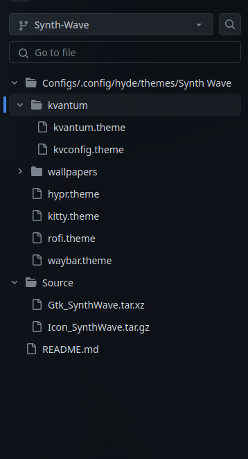

<p align="center"><br><br>
  
</p><br>


## Theme Structure

To create/add new theme (for ex. `Synth-Wave`), here are the files required to theme the base [applications](#theming-applications)   

<br>

> [!IMPORTANT]
> The theme name `Synth-Wave` should be consistent for all config file name
> 
> ```shell
> ~
> |⟼ /.config/
> |    |
> |    |⟼ hyde/themes/Synth-Wawe/
> |    |       ⮡ hypr.theme 
> |    |
> |    |⟼ hyde/themes/Synth-Wawe/
> |    |       ⮡ kitty.theme 
> |    |
> |    |⟼ hyde/themes/Synth-Wave/kvantum
> |    |       ⮡ kvantum.theme
> |    |       ⮡ kvconfig.theme 
> |    |
> |    |⟼ hyde/themes/Synth-Wave/
> |    |       ⮡ rofi.theme 
> |    |
> |    |⟼ hyde/themes
> |    |       ⮡ Synth Wave/wallpapers               # place wallpapers here
> |    |
> |    |⟼ hyde/themes/Synth-Wave
> |            ⮡ waybar.theme 
> | 
> |⟼ /.icons/
> |       ⮡ <icon-pack>/                    # for icons
> |       ⮡ <cursor-pack>/                  # for cursors
> | 
> |⟼ /.themes/
>         ⮡ Synth-Wave/                     # main theme for GTK apps
> ```

<br><br>


## Theming Applications

<div align = center><br>

&ensp;[<kbd> <br> Gtk Apps <br> </kbd>](#gtk-apps)&ensp;
&ensp;[<kbd> <br> Qt Apps <br> </kbd>](#qt-apps)&ensp;
&ensp;[<kbd> <br> Flatpak <br> </kbd>](#flatpaks)&ensp;
&ensp;[<kbd> <br> Hypr <br> </kbd>](#hypr)&ensp;
&ensp;[<kbd> <br> Kitty <br> </kbd>](#kitty)&ensp;
&ensp;[<kbd> <br> Rofi <br> </kbd>](#rofi)&ensp;
&ensp;[<kbd> <br> Walls <br> </kbd>](#wallpapers)&ensp;
&ensp;[<kbd> <br> Waybar <br> </kbd>](#waybar)&ensp;
&ensp;[<kbd> <br> Wlogout <br> </kbd>](#wlogout)&ensp;
<br><br><br></div>

> [!TIP]
> Please keep the color palette for your theme consistent across all the config files

<br>

### GTK apps
```shell
# target files
~/.themes/Synth-Wave/
```

Most applications like firefox follows GTK system theme.   
Download GTK3/4 theme pack and extract it to `~/.themes/`.   
Themes are available in https://www.gnome-look.org/browse?cat=135&ord=rating.   
You can also make your own gtk theme if you have time!   

<br>

### QT apps
```shell
# target files
~/.config/hyde/themes/Synth-Wave/kvantum/kvconfig.theme
~/.config/hyde/themes/Synth Wave/kvantum/kvantum.theme
```

Theming for QT applications are handled by Kvantum.  
- for Kvantum,   
    - refer [this](https://github.com/prasanthrangan/hyde-themes/blob/Synth-Wave/Configs/.config/hyde/themes/Synth%20Wave/kvantum/kvconfig.theme) file and modify the color codes as required              
    - refer [this](https://github.com/prasanthrangan/hyde-themes/blob/Synth-Wave/Configs/.config/hyde/themes/Synth%20Wave/kvantum/kvantum.theme) file and modify the color codes as required using a vector tool like inkscape   
<br>

### Flatpaks
```shell
# target files
~/.themes/Synth-Wave/
```

Flatpaks GTK apps automatically follows the GTK3/4 system theme, so no configuration is required.   

> [!NOTE]
> Flatpak QT apps currently does not support theming

<br>

### Hypr
```shell
# target files
~/.themes/Synth-Wave/
~/.icons/<icon-pack-name>
~/.icons/<cursor-pack-name>
~/.config/hyde/themes/Synth-Wave/hypr.theme
```

Refer [this](https://github.com/prasanthrangan/hyde-themes/blob/Synth-Wave/Configs/.config/hyde/themes/Synth%20Wave/hypr.theme) file and set the following in `~/.config/hypr/themes/Synth-Wave.conf`   
- set gtk theme as `exec = gsettings set org.gnome.desktop.interface icon-theme 'Synth-Wave'`   
- set icons as `exec = gsettings set org.gnome.desktop.interface icon-theme '<icon-pack-name>'`   
- set cursor as `exec = gsettings set org.gnome.desktop.interface cursor-theme '<cursor-pack-name>'`   
- modify the window properties like gaps, border colors, shadows, rounding, blur etc.   

<br>

### Kitty
```shell
# target files
~/.config/hyde/themes/Synth-Wave/kitty.theme
```

refer [this](https://github.com/prasanthrangan/hyde-themes/blob/Synth-Wave/Configs/.config/hyde/themes/Synth%20Wave/kitty.theme) file and modify the color codes as required   

<br>

### Rofi
```shell
# target files
~/.config/hyde/themes/Synth Wave/rofi.theme
```

refer [this](https://github.com/prasanthrangan/hyde-themes/blob/Synth-Wave/Configs/.config/hyde/themes/Synth%20Wave/rofi.theme) file and modify the color codes as required   

<br>

### Wallpapers
```shell
# target files
~/.config/hyde/themes/Synth Wave/wallpapers/*
```

Place all wallpapers that fits the theme in `~/.config/hyde/themes/Synth Wave/wallpapers/*` directory   
Currently `*.gif`, `*.jpg`, `*.jpeg`, `*.png` image formats are supported   

<br>

### Waybar
```shell
# target files
~/.config/hyde/themes/Synth Wave/waybar.theme
```

refer [this](https://github.com/prasanthrangan/hyde-themes/blob/Synth-Wave/Configs/.config/hyde/themes/Synth%20Wave/waybar.theme) file and modify the color codes as required   

<br>

### Wlogout
```shell
# target files
~/.config/hyde/themes/Synth Wave/waybar.theme
```

For wlogout, it imports the same colors from waybar, so no configuration is required   

<br>


## Activating Theme
Once you have the config file in place for all the [applications](#theming-applications), press ( <kbd>super</kbd> + <kbd>shift</kbd> + <kbd>T</kbd> ) to select your new theme

<br><br>


## Theme Patcher

Once you have the config files for all the [applications](#theming-applications) ready, you can either place them in a local directory or maintain it in a git repo.   

<br>

https://github.com/prasanthrangan/hyprdots-mod/assets/106020512/0c7f12a8-11f2-4a16-890e-44f07a860636

<br>

### Local Structure

Create a local directory for example `$HOME/Patch` and structure it as below   

<p align="center">

</p><br>

Execute themepatcher as below to patch it from local directory: 
```
cd ~/HyDE/Scripts # HyDE clone directory
./themepatcher.sh "Synth-Wave" "$HOME/Patch/Synth-Wave" "robbowen.synthwave-vscode~SynthWave '84"
```

### Git Structure

you can follow this [repo](https://github.com/prasanthrangan/hyprdots-mod) structure or fork it

<p align="center">

&ensp;&ensp;&ensp;&ensp;&ensp;&ensp;&ensp;&ensp;&ensp;&ensp;
</p><br>

Execute themepatcher as below to patch it from git repo: 
```
cd ~/HyDE/Scripts # HyDE clone directory
./themepatcher.sh "Synth-Wave" "https://github.com/prasanthrangan/hyprdots-mod/tree/Synth-Wave" "robbowen.synthwave-vscode~SynthWave '84"
```
